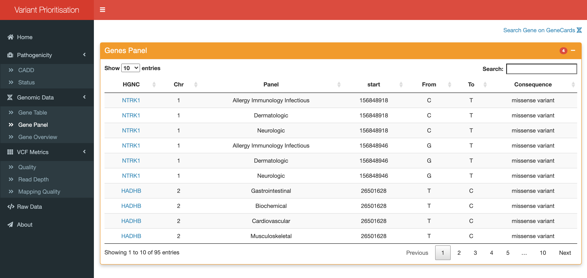

<!DOCTYPE html>
<html>
<head>
	<meta charset="utf-8"/>
</head>
<body>
<h1 id="Title">Variant Prioritisation</h1>

<h2 id="Objective">Objective</h2>

<p>The primary objective of this clinical variant prioritisation web application 
   is to improve upon the limited functionality of GAVIN and other popular variant
   calling/prioritisation tools. The application provides a tiered system ranking variants 
   in terms of their pathogenicity and role in known diseases, as well as providing additional 
   functionality such as summary reports of metrics used in variant classification 
   (e.g., quality, depth and allele frequency). 
   The application provides a clinician/user with the ability to filter by gene panels, 
   and query affected genes via the OMIM API, returning gene-phenotype information supported by literature. 
   As there is a veritable need for improvements to current variant prioritisation and visualisation methods, 
   this project will provide substantial positive progress to the movement 
   for improved sequence variant annotation and prioritisation from NGS projects.</p>

<h2 id="Project Workflow">Project Workflow</h2>


<h2 id="Run Variant Prioritisation">Run Variant Prioritisation</h2>

```
mkdir Running_VP
```

```
cd Running_VP
```

```
git clone https://github.com/oisinmccaffrey/VP_APP
```

Now run the App.R file (Running_VP/App.R) within RStudio. 


<h2 id="Pathogenicity">Pathogenicity</h2>

<h3 id="CADD Score vs. Minor Allele Frequency">CADD Score vs. Minor Allele Frequency</h3>


<h3 id="Variant Status">Variant Status</h3>


<h2 id="Genomic Data">Genomic Data</h2>

<h3 id="Genes Table">Genes Table</h3>


<h3 id="Genes Panel">Genes Panel</h3>



<h3 id="Gene Overview">Gene Overview</h3>


<h2 id="VCF Metrics">VCF Metrics</h2>


