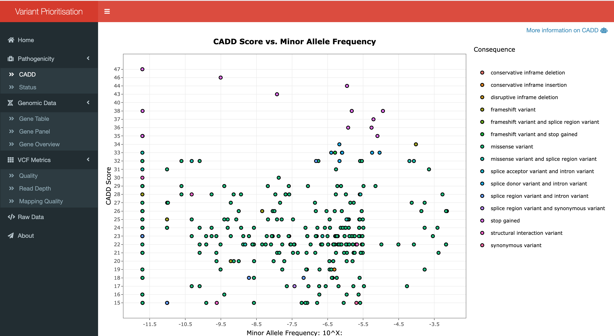
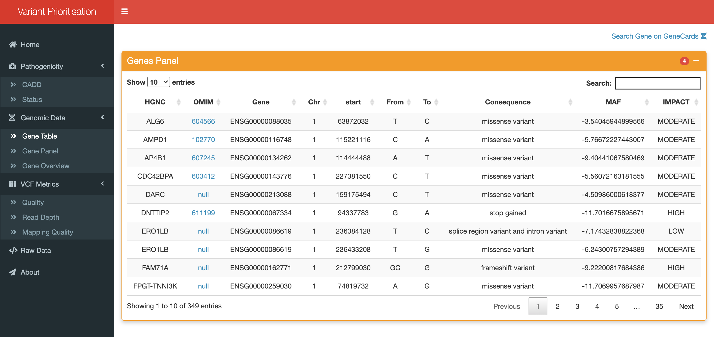

<!DOCTYPE html>
<html>
<head>
	<meta charset="utf-8"/>
</head>
<body>
<h1 id="Title">Variant Prioritisation</h1>

<h2 id="Objective">Objective</h2>

<p>The primary objective of this clinical variant prioritisation web application 
   is to improve upon the limited functionality of GAVIN and other popular variant
   calling/prioritisation tools. The application provides a tiered system ranking variants 
   in terms of their pathogenicity and role in known diseases, as well as providing additional 
   functionality such as summary reports of metrics used in variant classification 
   (e.g., quality, depth and allele frequency). 
   The application provides a clinician/user with the ability to filter by gene panels, 
   and query affected genes via the OMIM API, returning gene-phenotype information supported by literature. 
   As there is a veritable need for improvements to current variant prioritisation and visualisation methods, 
   this project will provide substantial positive progress to the movement 
   for improved sequence variant annotation and prioritisation from NGS projects.</p>

<h2 id="Project Workflow">Project Workflow</h2>


<h2 id="Run Variant Prioritisation">Run Variant Prioritisation</h2>

```
mkdir Running_VP
```

```
cd Running_VP
```

```
git clone https://github.com/oisinmccaffrey/VP_APP
```

Now run the App.R file (Running_VP/App.R) within RStudio. 

<h2 id="Home Page">Home Page</h2>


<h2 id="Pathogenicity">Pathogenicity</h2>

Variant Prioritisation user interface. Display shows the CADD vs. Minor Allele Frequency plot.
The plot embeds thefollowing interactive functions: 
1. Download plot as png. 2. Zoom/Pan/Lasso/Select.
3. Compare data on hover. 4. Filter by variantconsequence e.g. missense/stop-gain etc.

<h3 id="CADD Score vs. Minor Allele Frequency">CADD Score vs. Minor Allele Frequency</h3>



<h3 id="Variant Status">Variant Status</h3>


<h2 id="Genomic Data">Genomic Data</h2>

The gene table is curated to display the HGNC gene symbol, 
OMIM ID (with relevant hyperlink to the OMIM website), Ensemble Gene ID, 
Chromosome, Start position, SNP (e.g. from G to A), Consequence (e.g. Missense Variant), 
Minor AlleleFrequency (MAF), and Impact (e.g. moderate, high, low).

<h3 id="Genes Table">Genes Table</h3>



<h3 id="Genes Panel">Genes Panel</h3>


<h3 id="Gene Overview">Gene Overview</h3>


<h2 id="VCF Metrics">VCF Metrics</h2>

The distribution of VCF quality metrics. 
(A) - The read depth (DP) or coverage relates the amount of 
sequence data available at each position in the sequenced genome territory. 
(B) - The mapping quality (MQ) is typically an indication of how unique 
the region’s sequence is, the higher the MQ, the more unique the sequence. 
(C) - The quality (QUAL) is the sequencingquality, quantifying the probability 
that a polymorphism actually exists at the specific site. 
(D) - The QD is the QUAL scorenormalized by allele depth (AD) for a variant.


